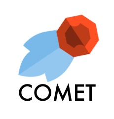
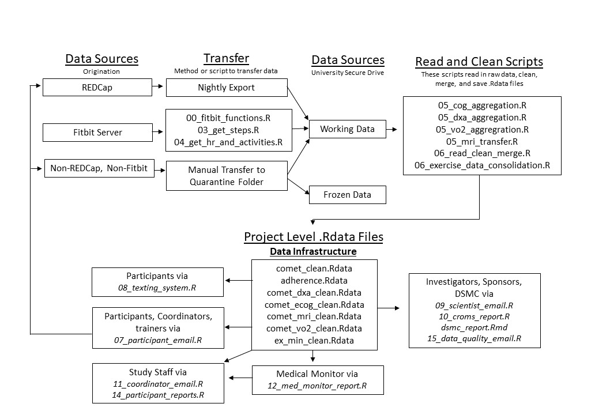
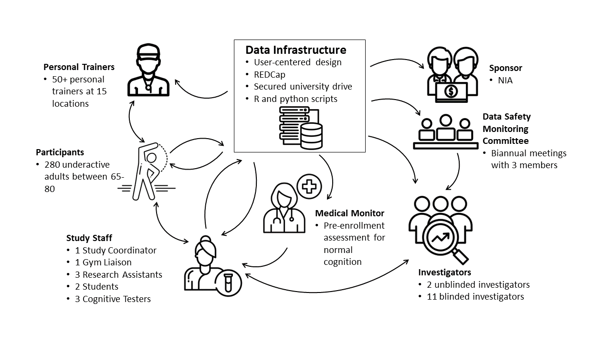

# OSSforEfficientClinicalTrialSupportCOMET

    

The Combined Exercise Trial (COMET, NCT04848038) is a randomized, controlled trial for 280 healthy, underactive adults between 65 and 80 to evaluate the impact of three different exercise modalities on cognitive health. The trial required a data management system to support varied data constraints and to improve efficiency and communication for stakeholders. This system was designed by two hobbiest programmers to suit the needs of the study. For full details, read the paper here.

This repository documents the state of the COMET data management system as of the publication of ...[paper], while also removing study data. We believe the clinical trial enterprise would benefit from an increased effort to automate aspects of data management and that through open software and open science principles automation can be made accessible without major technical expertise. We welcome collaboration and hope that our system will encourage other study teams to adapt and improve upon this system for clinical trial support.

## Project Data Flow

## Project Stakeholders

